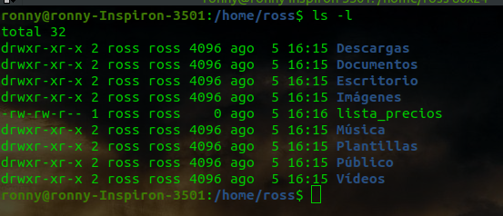
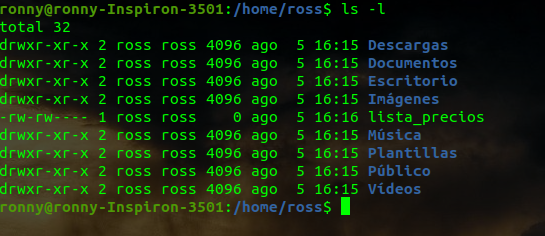
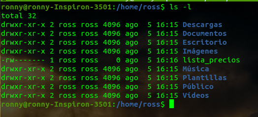

# RETO 2
## Consideraciones
* Identificar las medidas de seguridad a implementarse.
* Identificar el tipo de usuarios para quienes los permisos serán cambiados.
* Identificar el tipo de permiso que necesita ser cambiado.
* Verificar los permisos de acceso al archivo.

## Solución Paso a Paso
**Intente recrear el escenario propuesto y en base a esto escribir el paso a paso de mi posible solución**

Cree un usuario *ross* y dentro de home con este usuario cree el archivo lista de precios



Para cualquier usuario a excepcion de **ross** deberia restringirse cualquier tipo de permiso sobre este archivo

Se quitan permisos de ejecucion de otros usuarios(si tuviese otros permisos, de igual manera se lo quitaria)
```bash
chmod o=-r lista_precios
```


Se quitan permisos de lectura y escritura  a nivel de grupo(si tuviese otros permisos, de igual manera se lo quitaria)
```bash
chmod g=-rw lista_precios
```


Con lo anterior solamente ross puede manipular el archivo.

Si consideramos un escenario donde **ross** tiene un horario fijo todos los dias.
Podriamos asegurarnos que solamente **ross** pueda manipular el archivo en ese horario
Para ese nos ayudariamos con dos cron, que serian los siguientes:
1. habilita_permiso_ross: Coloca todos los permisos a la hora de entrada de ross
2. deshabilita_permiso_ross: Quita todos los permisos a la hora de salida de ross

Ejemplo:
 Suponiendo que ross tenga un horario de 8am a 5pm

00 08 * * * /ubicacion/del/script/habilita_permiso_ross.sh

```bash
chmod u=+rw lista_precios
```

00 17 * * * /ubicacion/del/script/deshabilita_permiso_ross.sh
```bash
chmod u=-rw lista_precios
```

Otra medida a evaluar es realizar un backup en algun otra ubicacion, equipo, o nube, donde de igual manera sea restringido el acceso al archivo.


