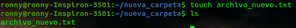
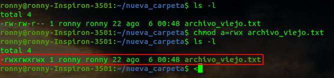
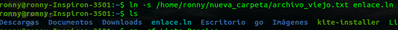

# SOLUCIÓN - Reto 3 - Linux - gestión de directorios
### Sitúate en tu directorio personal de usuario.
### Crea un directorio llamado "nueva_carpeta".

### Accede a esta carpeta que acabas de crear.

### Crea un archivo en este directorio y llámalo archivo_nuevo.txt.

### Cámbiale el nombre a este último archivo que has creado y llámalo archivo_viejo.txt.

### Añade el texto "Nueva línea de texto" al archivo desde el terminal.

### Cambia los permisos de este archivo para que todos los usuarios puedan leer, escribir y ejecutarlo.

### Sube un nivel de directorio, es decir, vuelve al directorio anterior.

### Crea un enlace al archivo que creaste en esta carpeta llamado "enlace.ln".

### Elimina el directorio "nueva_carpeta" y los archivos que contenga.

En este caso cree un enlace simbolico al archivo

